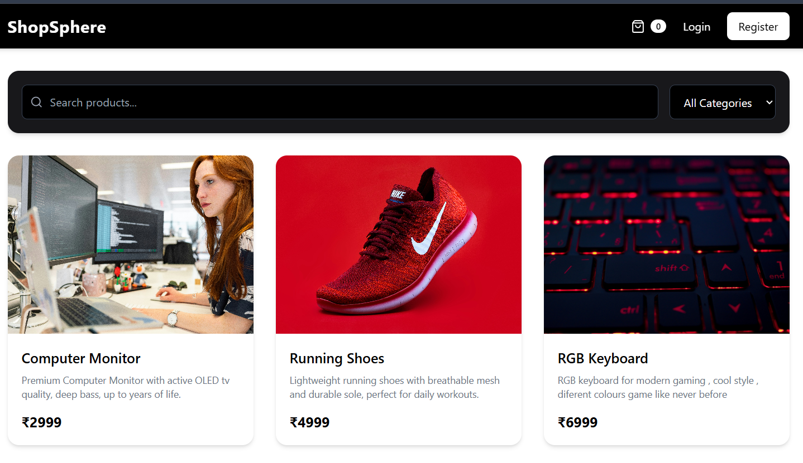
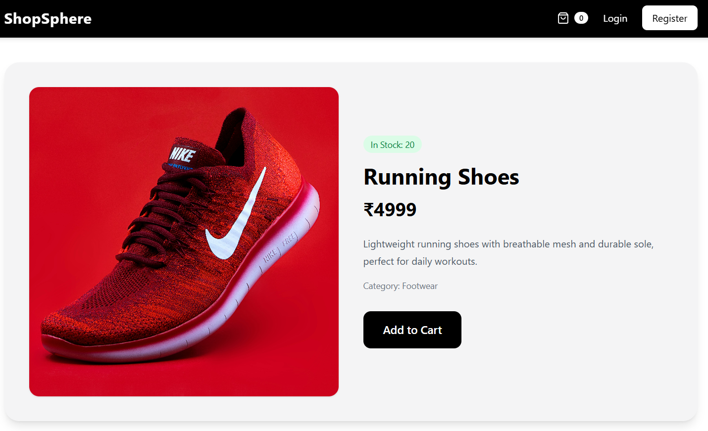
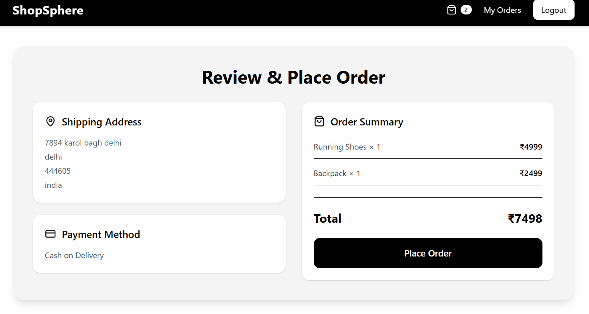
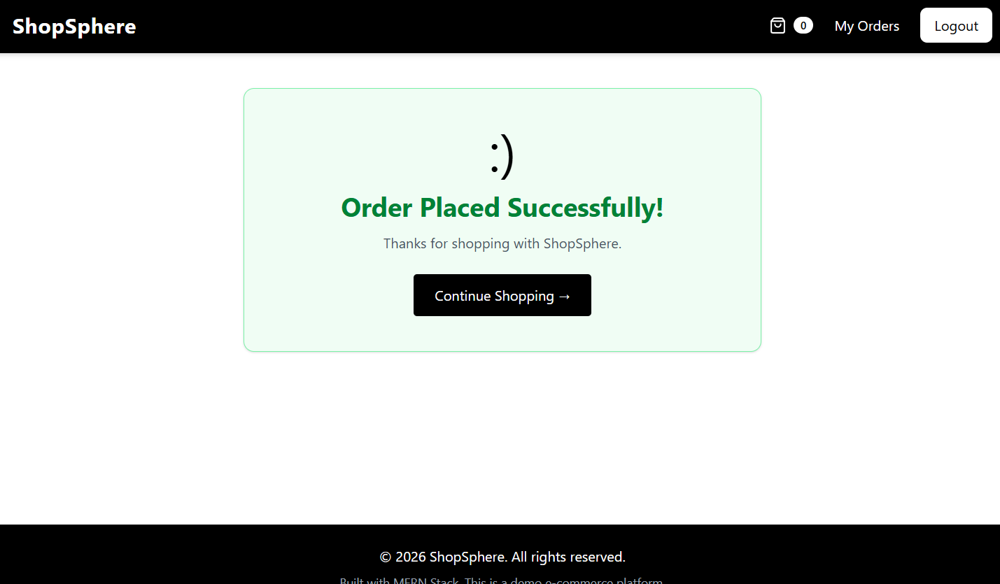

## ShopSphere – Full Stack MERN E-Commerce Application 

## About

ShopSphere is a full stack e-commerce web application built using the MERN stack (MongoDB, Express, React, Node.js).

This project was built as a real-world full stack learning project to understand how production-style e-commerce applications work — from frontend product browsing to backend order creation and database management.

Users can browse products, search and filter items, view detailed product pages, add products to cart, manage cart quantities, register/login securely using JWT authentication, place orders, and view order history.

The project demonstrates a complete end-to-end e-commerce workflow including frontend UI, backend APIs, authentication, cart persistence, order processing, and deployment.

## ⚠️ Note: This project is actively being improved. Some performance and UI enhancements are still in progress and will continue in future updates.

## Features

- Browse all products
- Product details page
- Search products by keyword
- Filter products by category
- JWT-based user authentication (Login/Register)
- Protected routes for authorized users
- Hybrid cart system:
- Guest cart using localStorage
- Logged-in user cart using MongoDB
- Automatic cart merge on login
- Add to cart
- Increase/decrease cart quantity
- Remove products from cart
- Shipping information form
- Place order flow
- Cash on Delivery checkout
- Order success page
- Order history page (user-specific)
- “Buy Again” functionality
- Fully responsive frontend UI
- Backend + frontend deployed successfully

## Project Structure / Components
- 
- Backend (Node.js + Express)
- server.js: backend entry point
- routes/productRoutes.js: product APIs
- routes/userRoutes.js: authentication APIs
- routes/cartRoutes.js: cart APIs
- routes/orderRoutes.js: order APIs
- controllers/: business logic layer
- models/Product.js: product schema
- models/User.js: user schema
- models/Order.js: order schema
- middleware/authMiddleware.js: JWT route protection
- config/db.js: MongoDB connection
 
- Frontend (React + Vite)

- App.jsx: route management
- main.jsx: frontend entry
- pages/Home.jsx: product listing
- pages/ProductDetails.jsx: product details
- pages/Cart.jsx: cart page
- pages/Shipping.jsx: shipping form
- pages/PlaceOrder.jsx: checkout review
- pages/Success.jsx: order success
- pages/Orders.jsx: order history
- pages/Login.jsx: login page
- pages/Register.jsx: register page
- components/Navbarjsx
- components/Footer.jsx
- components/ProductCard.jsx
- components/CartItem.jsx
- context/AuthContext.jsx
- context/CartContext.jsx
- services/api.js

## Technologies Used

- MongoDB Atlas (Database)
- Express.js (Backend framework)
- React.js (Frontend library)
- Node.js (Runtime environment)
- Mongoose (ODM)

##  JWT Authentication

- Tailwind CSS (Styling)
- React Router DOM
- Lucide React Icons
- Vite (Frontend build tool)
- Render (Backend deployment)
- Vercel (Frontend deployment)

- ## Screenshots

### Home Page

### Product Details

### Place Order Page

### Order Success page

## Learning Outcome

- Building a production-style MERN application
- Designing REST APIs
- JWT authentication and protected routes
- Managing global state with Context API
- Handling hybrid cart systems (guest + logged user)
- Order creation and order history flows
- Connecting frontend with backend APIs
- Deployment of full stack applications
- Debugging real-world issues such as:
- cart sync issues
- deployment errors
- API failures
- database bugs
- loading/performance issues
- Challenges Faced

One major planned feature was Razorpay payment integration.

During implementation, multiple issues were encountered involving:

payment flow instability
callback handling complexity
inconsistent test environment behavior
increased project complexity for current project scope

To maintain project stability and complete the core e-commerce workflow first, Razorpay integration was intentionally postponed for a future upgrade.

This was an important real-world learning decision: sometimes removing unstable features improves the final product.

## Known Limitations

The project is fully functional, but some improvements are still in progress:

- Product images may load slowly due to external image URLs
- Backend may take time on first load because Render free tier sleeps
- Minor UI polish is still ongoing
- Some pages can feel slightly slow on lower-end devices
- Performance optimization is planned for future updates

These issues are currently being worked on.

## Future Development

Planned future upgrades include:

- Razorpay payment integration
- cloudinary image hosting and optimization
- Admin dashboard
- add products
- edit products
- delete products
- manage orders
- Advanced product filters
- Better loading states and skeleton loaders
- More polished UI/UX
- smoother transitions and animations
- performance optimization
- faster image loading
- wishlist functionality
- product reviews and ratings
- user profile management
- better mobile experience
- production-grade deployment improvements
- custom domain setup

## Notes

This is a real-world learning-focused MERN project

- Backend deployed on Render
- Frontend deployed on Vercel
- Environment variables used for secure configuration
- Development is ongoing and improvements will continue
- Live Demo

Frontend: https://shop-sphere-zeta-eight.vercel.app/

Backend API: https://shopsphere-backend-2wim.onrender.com/

## Status

Project Status: Active Development

Core functionality is complete.

The application is fully usable and deployed, with future enhancements planned to improve performance, scalability, and production readiness.
